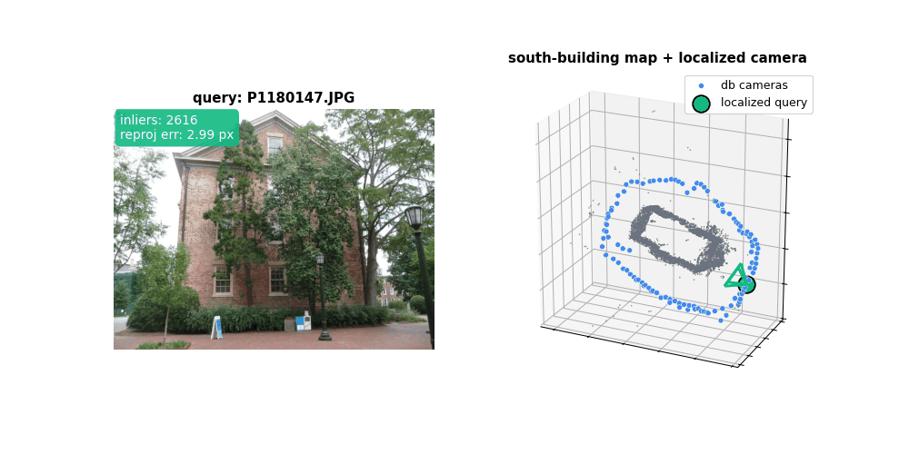
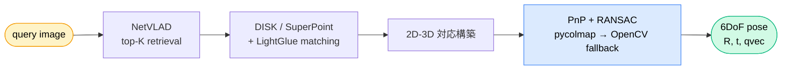

<div align="center">

# visual-map-localizer

**Single-image 6DoF Visual Positioning System on top of COLMAP / hloc.**

*1 枚の画像からカメラ姿勢を推定する、CLI / Python / ROS2 兼用の VPS*

[](https://github.com/rsasaki0109/visual-map-localizer/actions/workflows/ci.yml)
[](LICENSE)
[](https://www.python.org/)
[](https://github.com/colmap/colmap)
[](https://github.com/cvg/Hierarchical-Localization)
[](https://docs.ros.org/en/jazzy/)

<br>



<sub>Each frame: a single query image (left) and the camera pose recovered against a COLMAP map (right, green = localized camera).<br>
South-Building dataset, 118 db / 10 query images, DISK + LightGlue + NetVLAD.</sub>

</div>

---

<table align="center">
<thead>
<tr>
<th></th>
<th align="center"><sub>Success</sub></th>
<th align="center"><sub>Median rot. err</sub></th>
<th align="center"><sub>Median trans. err</sub></th>
</tr>
</thead>
<tbody>
<tr>
<td align="right"><b>south-building</b><br><sub>118 db / 10 query, single capture day</sub></td>
<td align="center"><b>10 / 10</b></td>
<td align="center"><b>0.066°</b></td>
<td align="center"><b>0.034 %</b><br><sub>of scene</sub></td>
</tr>
<tr>
<td align="right"><b>Cambridge ShopFacade</b><br><sub>231 db / 103 query, multi-day, w/ pedestrians</sub></td>
<td align="center"><b>103 / 103</b></td>
<td align="center"><b>0.93°</b></td>
<td align="center"><b>0.49 %</b><br><sub>of scene</sub></td>
</tr>
</tbody>
</table>

---

## 概要

COLMAP で構築した SfM 地図に対して、**1 枚の query 画像から 6DoF カメラ姿勢を推定する**
Visual Positioning System (VPS) 実装です。
内部では [hloc (Hierarchical-Localization)](https://github.com/cvg/Hierarchical-Localization)
の Retrieval / Matching パイプラインを薄くラップしつつ、CLI と
クリーンな Python API、そして ROS2 ノードを同梱しています。



## 目次

- [ハイライト](#ハイライト)
- [Quick Start](#quick-start)
- [インストール](#インストール)
- [使い方 (CLI)](#使い方-cli)
- [Python API](#python-api)
- [レイテンシ](#レイテンシ)
- [公開データセット検証 (south-building)](#公開データセット検証-south-building-128-枚)
- [公開データセット検証 (Cambridge ShopFacade)](#公開データセット検証-cambridge-shopfacade-334-枚)
- [ROS2 統合](#ros2-統合)
- [制約 / 注意](#制約--注意)
- [開発](#開発)
- [ライセンス](#ライセンス)

## ハイライト

| | |
|---|---|
| **CLI ファースト** | `visual-map-localizer build-map` と `... localize` だけで完結 |
| **Python API** | `VisualMapLocalizer().localize(path or np.ndarray)` で常駐サーバ向けに使い回し可 |
| **ROS2 ノード同梱** | `/camera/image_raw` → `/vps_pose` (PoseWithCovarianceStamped) |
| **GPU / CPU 両対応** | CUDA があれば 1.4s/frame、CPU でも動く |
| **JSON 出力** | pose・inlier 数・reprojection error・retrieval Top-K |
| **PnP 二段構え** | pycolmap が第 1 選択 / OpenCV `solvePnPRansac` が fallback |
| **Apache-2.0 構成** | DISK + LightGlue + NetVLAD なら third-party submodule 不要 |
| **軽量 install** | lazy import で `torch` / `hloc` 抜きでも import / unit-test が通る |

## Quick Start

south-building (COLMAP 公式の 128 枚デモデータセット) で end-to-end が動くまでを 1 つのブロックに。
**1 枚を held-out query** にして残り 127 枚で build-map することで、ちゃんと "未知画像を localize する" 流れになります。

```bash
# 0) インストール (deep extras + hloc は localize / build-map に必要)
pip install -e ".[deep]"
pip install git+https://github.com/cvg/Hierarchical-Localization.git@master

# 1) データ取得
mkdir -p /tmp/vml-public && cd /tmp/vml-public
curl -L -o south-building.zip \
  https://github.com/colmap/colmap/releases/download/3.11.1/south-building.zip
unzip -q south-building.zip

# 2) 1 枚を held-out query に分離 (= 残り 127 枚を DB として使う)
mkdir -p /tmp/vml-public/db_images
cp /tmp/vml-public/south-building/images/*.JPG /tmp/vml-public/db_images/
mv /tmp/vml-public/db_images/P1180141.JPG /tmp/vml-public/query.JPG

# 3) マップ構築 (DISK + LightGlue, retrieval-based pairs)
visual-map-localizer build-map \
    --images /tmp/vml-public/db_images \
    --output /tmp/vml-public/map \
    --local-feature disk --matcher disk+lightglue \
    --num-covisible-pairs 20

# 4) held-out query を localize (south-building の intrinsics をそのまま指定)
visual-map-localizer localize \
    --map /tmp/vml-public/map \
    --query /tmp/vml-public/query.JPG \
    --camera-model SIMPLE_RADIAL \
    --camera-params 2559.68,1536,1152,-0.0204997 \
    --image-size 3072x2304
```

> **TL;DR**: 出力 JSON に `success: true` と 1000 を超える `inliers`、
> `reproj_error < 3px` が出ていれば成功です。
> より厳密な精度評価 (10 query × Sim(3) 整列 + reference SfM 比較) は
> [公開データセット検証](#公開データセット検証-south-building-128-枚) を参照。

## インストール

### 軽量インストール (PnP・JSON I/O・テスト用途)

`torch` / `hloc` を入れずに済むので CI / ROS bridge / 解析スクリプトに最適。
`visual_map_localizer` は PEP 562 lazy import で深層学習依存を遅延ロード
するため、Retrieval / Matching を呼ばない限りこの構成でも動きます。

```bash
pip install -e .
```

### フルインストール (Build-map / Localize を実行する場合)

```bash
# 1) PyTorch を CUDA に合わせて (例: CUDA 12.1)
pip install torch torchvision --index-url https://download.pytorch.org/whl/cu121

# 2) 本パッケージ + deep extras
pip install -e ".[deep]"

# 3) hloc (PyPI 未公開なので git から)
pip install git+https://github.com/cvg/Hierarchical-Localization.git@master

# 4) 動作確認
python -c "import pycolmap; print(pycolmap.__version__)"
python -c "from hloc import extract_features; print(list(extract_features.confs)[:5])"
```

## 使い方 (CLI)

### マップ構築

```bash
# 既定 (SuperPoint + LightGlue) — SuperGluePretrainedNetwork submodule が必要
visual-map-localizer build-map \
    --images ./images \
    --output ./map

# Apache-2.0 構成 (third-party submodule 不要、商用利用可)
visual-map-localizer build-map \
    --images ./images \
    --output ./map \
    --local-feature disk \
    --matcher disk+lightglue
```

> **補足:** 既定の SuperPoint は hloc が `third_party/SuperGluePretrainedNetwork`
> サブモジュールから読み込みます。pip 経由で hloc を入れた場合はサブモジュールが
> 含まれないため、上記の DISK + LightGlue 構成のほうが確実に動きます。

主なオプション:

| Option | 既定 | 説明 |
|---|---|---|
| `--local-feature` | `superpoint_aachen` | hloc の local feature config 名 |
| `--global-descriptor` | `netvlad` | hloc の global descriptor config 名 |
| `--matcher` | `superpoint+lightglue` | hloc の matcher config 名 |
| `--num-covisible-pairs` | `None` (exhaustive) | retrieval-based pairs (大規模向け) |
| `--overwrite` | off | 中間ファイルを再生成 |

出力ディレクトリ構造:

```
map/
├── sfm/                       # COLMAP sparse model
├── features.h5                # SuperPoint / DISK
├── global_descriptors.h5      # NetVLAD
├── pairs-sfm.txt
├── matches-sfm.h5
├── db_images.txt
└── map_meta.json
```

### 1 枚の画像をローカライズ

```bash
visual-map-localizer localize \
    --map ./map \
    --query query.jpg
```

> localize 側は `map_meta.json` を読んで build-map 時と同じ
> `local-feature` / `global-descriptor` / `matcher` を自動採用します。
> 明示指定したい場合のみ CLI オプションで上書きしてください。

主なオプション:

| Option | 既定 | 説明 |
|---|---|---|
| `--top-k` | 10 | retrieval 候補数 |
| `--ransac-max-error` | 12.0 | RANSAC reprojection threshold (px) |
| `--min-inliers` | 12 | これ未満なら success=false |
| `--matcher` | `superpoint+lightglue` | localize 時の matcher |
| `--camera-model` | (推定) | 例: `PINHOLE` (params も必須) |
| `--camera-params` | (推定) | カンマ区切り (例: `fx,fy,cx,cy`) |
| `--image-size` | (画像から取得) | `--camera-model` 指定時に必要 |
| `--output` | stdout | JSON を書き出すパス |

成功時の JSON:

```json
{
  "success": true,
  "pose": {
    "R": [[0.999, 0.034, 0.012], [-0.034, 0.999, 0.005], [-0.012, -0.005, 1.000]],
    "t": [1.234, -0.567, 5.890],
    "qvec": [0.9999, 0.017, 0.006, 0.001]
  },
  "inliers": 128,
  "reproj_error": 0.91,
  "num_matches": 612,
  "retrieval": ["db/0001.jpg", "db/0007.jpg", "db/0042.jpg"],
  "query": "/abs/path/query.jpg",
  "timing": {"total": 1.42, "pnp": 0.03, "matching": 0.21}
}
```

失敗時:

```json
{
  "success": false,
  "error": "PnP failed",
  "retrieval": ["db/0001.jpg", "..."],
  "num_matches": 4,
  "query": "/abs/path/query.jpg",
  "timing": {"total": 0.97}
}
```

CLI の終了コード:

| Code | 意味 |
|---|---|
| `0` | 成功 |
| `2` | ローカライズ失敗 (画像 / マップは正常に読めた) |
| `1` | 引数 / IO エラー |

### マップの中身を確認

```bash
visual-map-localizer inspect --map ./map
```

## Python API

```python
from visual_map_localizer import VisualMapLocalizer
from visual_map_localizer.config import LocalizeConfig

localizer = VisualMapLocalizer(
    "./map",
    config=LocalizeConfig(top_k=15, ransac_max_error_px=8.0),
)
result = localizer.localize("query.jpg")
print(result.success, result.inliers)
print(result.to_json())
```

### np.ndarray を直接渡す (ROS 統合・常駐サーバ向け)

```python
import numpy as np
from PIL import Image
import pycolmap

from visual_map_localizer import VisualMapLocalizer
from visual_map_localizer.config import LocalizeConfig

localizer = VisualMapLocalizer("./map", config=LocalizeConfig(top_k=10))

# どこかのストリーム / cv_bridge / カメラ SDK から:
rgb = np.asarray(Image.open("query.jpg").convert("RGB"))  # H×W×3 uint8 (RGB)

camera = pycolmap.Camera(
    model="PINHOLE", width=rgb.shape[1], height=rgb.shape[0],
    params=[fx, fy, cx, cy],
)
result = localizer.localize(rgb, camera=camera, name="frame_0123.png")
print(result.inliers, result.pose["t"])
```

`localize()` は `Path` / `str` / `np.ndarray` のいずれも受け取ります。
ndarray の場合は `camera` 必須（EXIF が無いため）。
`name` は省略可能で、内部キャッシュキーになります。

### マップ構築 (Python API)

```python
from visual_map_localizer.mapping import build_map
from visual_map_localizer.config import MappingConfig

build_map(
    image_dir="./images",
    output_dir="./map",
    config=MappingConfig(num_covisible_pairs=20),
)
```

## レイテンシ

south-building (118 db imgs, 3072×2304 query, GPU, DISK + LightGlue + NetVLAD):

| 起動方法 | 初回 (warmup 込) | 2 回目以降 (steady-state) |
|---|---|---|
| `localize` を毎回 subprocess で起動 | — | **8.6 s / query** |
| `VisualMapLocalizer` 使い回し (path 入力) | 4.1 s | **1.1 s / query** |
| `VisualMapLocalizer` 使い回し (ndarray 入力) | 4.4 s | **1.4 s / query** |

> ndarray 版の +0.3s は PNG エンコードが主因。ROS 系の **1280×720** クラスなら
> エンコードが 0.03s 程度に縮むので、サブセカンドが現実的です。
> 詳細プロファイルは `scripts/profile_localize.py` を参照。

## 公開データセット検証 (south-building, 128 枚)

COLMAP 公式の `south-building` データセット (Schönberger 氏配布、reference SfM 同梱) で
end-to-end 検証した結果です。128 枚を 118 db / 10 query に分割し、118 枚で
build-map → 10 枚を順次 localize → 同梱 reference SfM との pose 誤差を
Sim(3) 整列で評価:

| 指標 | 値 |
|---|---|
| **成功率** | **10 / 10** |
| inlier 数 | 2616〜5229 |
| reprojection error | 1.25〜2.99 px |
| 1 query あたり所要 (CPU/GPU 込) | 約 8.6 s |
| **回転誤差** | median **0.066°**, mean 0.074°, max 0.174° |
| **並進誤差** | median **0.0034**, max 0.0046<br>(シーン全幅 10.81、つまり **0.03〜0.04 %**) |
| 自前 SfM と reference SfM の整列残差 | mean 0.0035 (= 0.03 % of scene scale) |

つまり、localizer が出す pose は **SfM 自身の数値ノイズと同オーダー** で
reference SfM と一致しています。

<details>
<summary><b>再現手順 (クリックで展開)</b></summary>

```bash
# 1) データ取得
mkdir -p /tmp/vml-public && cd /tmp/vml-public
curl -L -o south-building.zip \
  https://github.com/colmap/colmap/releases/download/3.11.1/south-building.zip
unzip -q south-building.zip

# 2) 118 / 10 に分割 (seed 固定)
python3 - <<'PY'
import random, shutil
from pathlib import Path
src = Path('/tmp/vml-public/south-building/images')
imgs = sorted(p.name for p in src.iterdir() if p.suffix.lower() == '.jpg')
qs = sorted(random.Random(42).sample(imgs, 10))
db = [n for n in imgs if n not in qs]
Path('/tmp/vml-public/db_images').mkdir(exist_ok=True)
Path('/tmp/vml-public/query_images').mkdir(exist_ok=True)
for n in db: shutil.copy(src/n, Path('/tmp/vml-public/db_images')/n)
for n in qs: shutil.copy(src/n, Path('/tmp/vml-public/query_images')/n)
PY

# 3) build-map (118 imgs, retrieval-based pairs)
visual-map-localizer build-map \
    --images /tmp/vml-public/db_images \
    --output /tmp/vml-public/map \
    --local-feature disk --matcher disk+lightglue \
    --num-covisible-pairs 20

# 4) 10 queries を localize
mkdir -p /tmp/vml-public/results
for q in /tmp/vml-public/query_images/*.JPG; do
    visual-map-localizer localize \
        --map /tmp/vml-public/map --query "$q" \
        --camera-model SIMPLE_RADIAL \
        --camera-params 2559.68,1536,1152,-0.0204997 \
        --image-size 3072x2304 \
        --output /tmp/vml-public/results/$(basename "$q" .JPG).json
done

# 5) reference SfM と比較
python3 scripts/evaluate_south_building.py \
    --dataset /tmp/vml-public/south-building \
    --map-dir /tmp/vml-public/map \
    --results-dir /tmp/vml-public/results
```

</details>

## 公開データセット検証 (Cambridge ShopFacade, 334 枚)

south-building は単一日のキャプチャなので "条件が一定で簡単" な部類です。
そこでもう 1 段難しい標準ベンチマーク **[Cambridge Landmarks](https://www.repository.cam.ac.uk/handle/1810/251336) ShopFacade**
(屋外の通り、撮影日が異なる、人や車の写り込みあり) でも検証しました。
公式 train/test split (231 db / 103 test) をそのまま使い、
DISK + LightGlue + NetVLAD で 1 度だけ実行した結果:

| 指標 | 値 |
|---|---|
| **成功率** | **103 / 103** |
| inlier 数 (median) | ≈ 5000 |
| reprojection error | 〜5 px |
| **回転誤差** | median **0.93°**, mean 0.99°, max 2.49° |
| **並進誤差** | median **0.21 m**, max 2.08 m<br>(シーン全幅 42.7 m、つまり **0.49 % / 4.89 %**) |
| 1 query あたり所要 (in-process API) | median **5.84 s** (1920×1080) |
| Sim(3) 整列に使った train 画像 | 231 / 231 (100% reconstructed) |

south-building (median 0.066° / 0.034%) より 1 桁悪化していますが、
照度変化・歩行者・車両・経年変化を含む屋外データに対して **全 103 枚** が成功し、
median 並進誤差がシーン全幅の 0.5 % 未満に収まっているのは、
このパイプラインが "easy デモ" 専用ではなく VPS ベンチの本流で動くことを示しています。

<details>
<summary><b>再現手順 (クリックで展開)</b></summary>

```bash
# 1) データ取得 (~1.4 GB)
mkdir -p /tmp/vml-public/cambridge && cd /tmp/vml-public/cambridge
curl -L -o ShopFacade.zip \
  "https://api.repository.cam.ac.uk/server/api/core/bitstreams/4e5c67dd-9497-4a1d-add4-fd0e00bcb8cb/content"
unzip -q ShopFacade.zip

# 2) train/test を flat な symlink に並べ、intrinsics.json を書き出す
python3 scripts/evaluate_cambridge.py prepare \
    --scene /tmp/vml-public/cambridge/ShopFacade \
    --work /tmp/vml-public/cambridge/work

# 3) 231 train 画像で build-map
visual-map-localizer build-map \
    --images /tmp/vml-public/cambridge/work/train_images \
    --output /tmp/vml-public/cambridge/work/map \
    --local-feature disk --matcher disk+lightglue \
    --num-covisible-pairs 20

# 4) 103 test 画像を一気に localize (in-process API)
python3 scripts/evaluate_cambridge.py localize-all \
    --scene /tmp/vml-public/cambridge/ShopFacade \
    --work /tmp/vml-public/cambridge/work

# 5) Sim(3) 整列 + 回転 / 並進誤差を集計
python3 scripts/evaluate_cambridge.py score \
    --scene /tmp/vml-public/cambridge/ShopFacade \
    --work /tmp/vml-public/cambridge/work
```

</details>

## ROS2 統合

ROS2 (Jazzy 想定) ノードは [`ros2/visual_map_localizer_ros/`](ros2/visual_map_localizer_ros/) 配下にあります。

```bash
# (build-map で作ったマップに対して)
ros2 launch visual_map_localizer_ros vps.launch.py \
    map_dir:=/abs/path/to/map \
    publish_tf:=true
```

| | |
|---|---|
| **sub** | `/camera/image_raw` (sensor_msgs/Image) + `/camera/camera_info` (CameraInfo) |
| **pub** | `/vps_pose` (geometry_msgs/PoseWithCovarianceStamped) ※ ROS 慣例 world-from-camera |
| **TF** | `frame_id → child_frame_id` (`publish_tf:=true`) |
| **drop policy** | in-flight 中の画像は drop (1Hz 級の絶対姿勢源として利用) |
| **NumPy 2.x 互換** | cv_bridge を使わず手書き変換でビルド済み |

詳細は [`ros2/visual_map_localizer_ros/README.md`](ros2/visual_map_localizer_ros/README.md) を参照。

## 制約 / 注意

詳細は [`docs/limitations.md`](docs/limitations.md) 参照。

- 屋外の **強い照度変化 / 季節変化** には弱い (NetVLAD + SuperPoint の限界)
- `--camera-model` を指定しない場合は EXIF / 60° FoV からの推定にフォールバック
- SfM が成立する程度の画像 overlap が必要 (経験則: 隣接で 60% 以上)
- SuperPoint / SuperGlue は研究用ライセンス。商用は **DISK + LightGlue** を推奨

## アーキテクチャ / 拡張

- [`docs/architecture.md`](docs/architecture.md) — モジュール構成 / データフロー
- [`docs/ros2_integration.md`](docs/ros2_integration.md) — 設計ノート (実装は `ros2/`)
- 大規模地図対応 (sharding / Faiss ANN) はアーキテクチャドキュメントに記載

## 開発

```bash
pip install -e ".[dev]"
pytest -q
ruff check visual_map_localizer tests
```

- `tests/test_pnp.py` は pycolmap / OpenCV があれば実行されます。
- `tests/test_imports.py` は重い依存なしで通る import スモークテストです。
- `tests/test_array_path.py` は ndarray 入力のキャッシュキー不変性を検証します。

CI ではこれを Python 3.10 / 3.11 / 3.12 で実行しています ([`.github/workflows/ci.yml`](.github/workflows/ci.yml))。

## サンプル

- [`examples/build_map_example.py`](examples/build_map_example.py)
- [`examples/localize_example.py`](examples/localize_example.py)
- [`scripts/evaluate_south_building.py`](scripts/evaluate_south_building.py) — south-building 用の Sim(3) 整列 + pose 誤差評価
- [`scripts/evaluate_cambridge.py`](scripts/evaluate_cambridge.py) — Cambridge Landmarks (NVM) 用の 3-stage 評価 (`prepare` / `localize-all` / `score`)
- [`scripts/profile_localize.py`](scripts/profile_localize.py) — 常駐プロセスのレイテンシ計測

## ライセンス

[Apache-2.0](LICENSE) (本リポジトリ)。

内部で利用するモデル重み (SuperPoint / SuperGlue / NetVLAD) は **各々のライセンスに従う必要** があります。
完全に商用フレンドリーな構成にしたい場合は、本 README で示す
**DISK + LightGlue + NetVLAD** の組み合わせをご利用ください。
